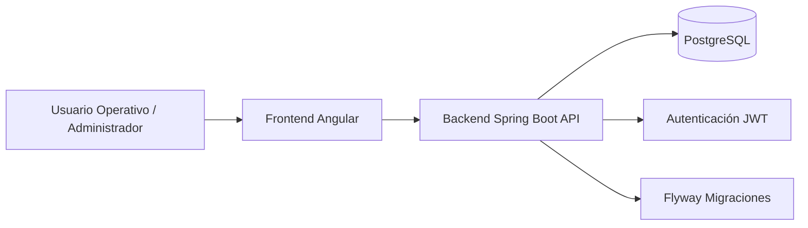
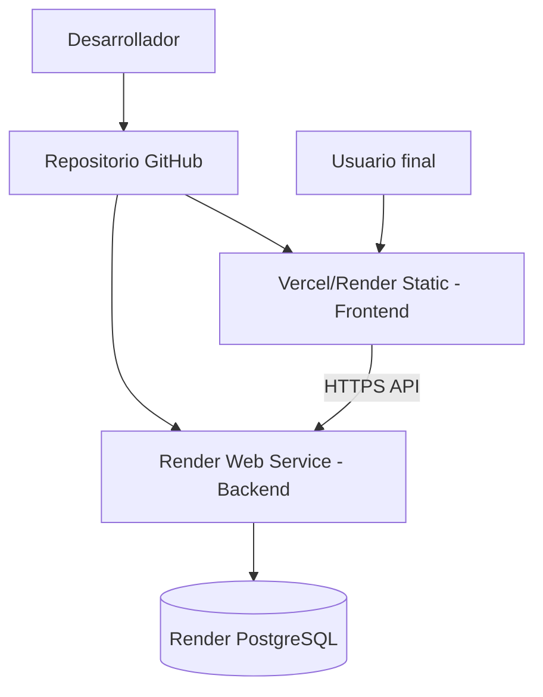
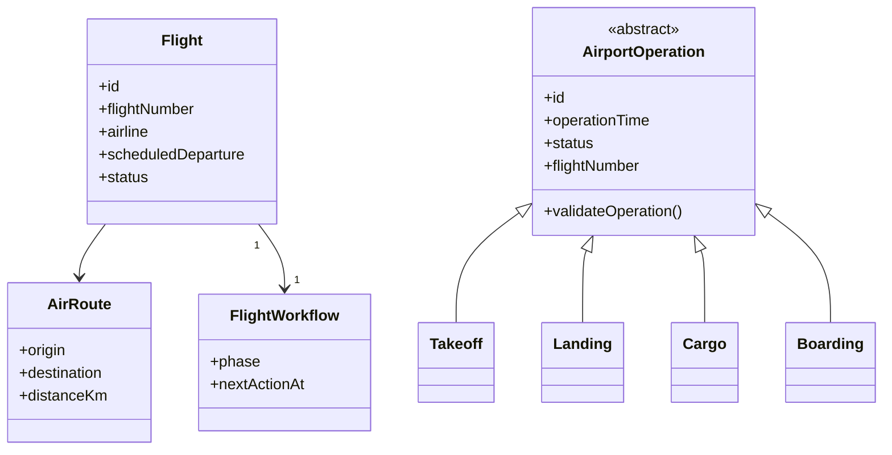
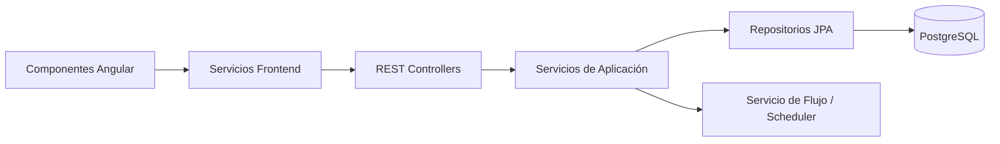
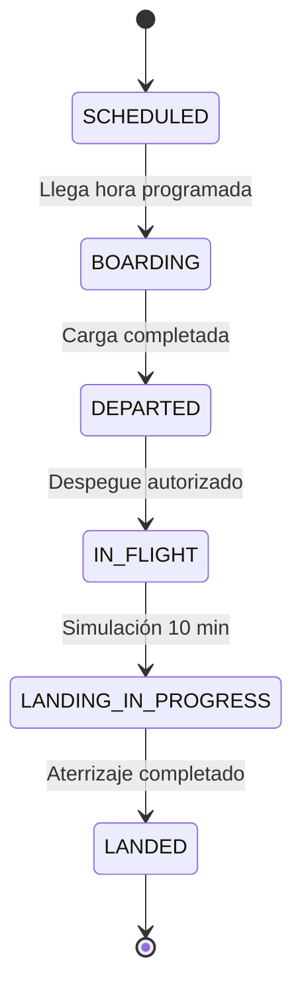

# AIRCONTROL PRO — Sistema Inteligente de Gestión Aeroportuaria Comercial

## 🚀 Descripción del Proyecto
AIRCONTROL PRO es una plataforma empresarial diseñada para la gestión integral de operaciones aeroportuarias comerciales. El sistema permite el monitoreo y validación en tiempo real de despegues, aterrizajes, embarques y zonas de carga, garantizando la seguridad y eficiencia operacional.

## 🏗️ Arquitectura del Sistema
El proyecto sigue los principios de **Clean Architecture** y **SOLID**, utilizando una estructura de capas:
- **API Layer**: Controladores REST para la comunicación con el frontend.
- **Service Layer**: Lógica de negocio centralizada.
- **Persistence Layer**: Repositorios JPA para el acceso a datos.
- **Domain Layer**: Entidades de negocio con herencia y polimorfismo.

## 🧭 Diseño

### 1) Contexto


### 2) Despliegue


### 3) Conceptual


### 4) Desarrollo


### 5) Funcional


### 🧠 Implementación de POO Avanzada
- **Herencia**: Jerarquías de usuarios (`User` -> `Admin`, `Controller`) y operaciones (`AirportOperation` -> `Takeoff`, `Landing`).
- **Polimorfismo**: Método `validateOperation()` implementado de forma única en cada subclase de operación.
- **Recursividad**:
  - Árbol de rutas aéreas para cálculo de distancias totales.
  - Menú dinámico recursivo para la navegación.
- **Interfaces**: Uso de interfaces como `Monitorable`, `Reportable` y `Auditable` para herencia múltiple de comportamiento.

## 🛠️ Stack Tecnológico
### Backend
- Java 21/25 & Spring Boot 3.2.5
- Spring Security & JWT
- Spring Data JPA & PostgreSQL
- Flyway (Migraciones de DB)
- Maven

### Frontend
- Angular 19+ (Standalone Components)
- Angular Material
- RxJS & Signals (Gestión de Estado)
- Reactive Forms

## 📦 Configuración y Ejecución Local

### 1. Base de Datos

**Opción A — Docker (recomendado)**

Desde la raíz del proyecto:

```powershell
docker compose up -d
```

Esto levanta PostgreSQL en `localhost:5432` con base de datos `aircontrolpro`, usuario `postgres` y contraseña `postgres`.

**Opción B — PostgreSQL manual**

1. Crea una base de datos llamada `aircontrolpro`.
2. Usuario `postgres` / contraseña `postgres` (o define variables de entorno `SPRING_DATASOURCE_*`).
3. Flyway aplicará el esquema al iniciar el backend.

### 2. Ejecutar Backend

Abre una terminal en la carpeta `backend` y ejecuta:

```powershell
mvn spring-boot:run
```

**Perfiles de base de datos**

| Perfil | Cuándo usarlo | Conexión por defecto |
|--------|---------------|----------------------|
| `local` (por defecto) | PostgreSQL ya instalado en tu PC | `5440` / `mi_basedatos` / contraseña `123456` |
| `docker` | Tras `docker compose up -d` | `5432` / `aircontrolpro` / contraseña `postgres` |

```powershell
# Con Docker Compose
$env:SPRING_PROFILES_ACTIVE="docker"
mvn spring-boot:run
```

Si tu PostgreSQL usa otras credenciales, define variables antes de ejecutar:

```powershell
$env:SPRING_DATASOURCE_URL="jdbc:postgresql://127.0.0.1:5432/tu_base"
$env:SPRING_DATASOURCE_PASSWORD="tu_contraseña"
mvn spring-boot:run
```

### 3. Ejecutar Frontend
1.  Abre una terminal en la carpeta `frontend`.
2.  Instala las dependencias:
    ```bash
    npm install
    ```
3.  Inicia la aplicación:
    ```bash
    npm start
    ```
    *La aplicación usará un proxy interno para comunicarse con `http://localhost:8080`.*

## 🔐 Seguridad
El sistema implementa seguridad basada en **JWT (JSON Web Tokens)** con:
- Autenticación sin estado.
- Roles de usuario: `ADMIN`, `CONTROLADOR`, `EMBARQUE`, `CARGA`, `OPERADOR`.
- Credenciales iniciales: **admin / admin123**.

## 🧪 Pruebas
- **Backend**: `mvn test` en la carpeta backend.
- **Frontend**: `npm test` en la carpeta frontend.

---
© 2026 AIRCONTROL PRO - Senior Software Engineering Project
